[](https://github.com/Yuriu-Zhuravlev/lcm-microservices/actions/workflows/ci.yml)

# LCM — Learning Content Management Platform

A backend platform for creating and completing online courses, built with a microservices architecture on **Java 21 + Spring Boot 4**. The system supports course authoring, student enrollment, lesson-by-lesson progress tracking, and quiz submission — all behind a single API Gateway with JWT-based authentication.

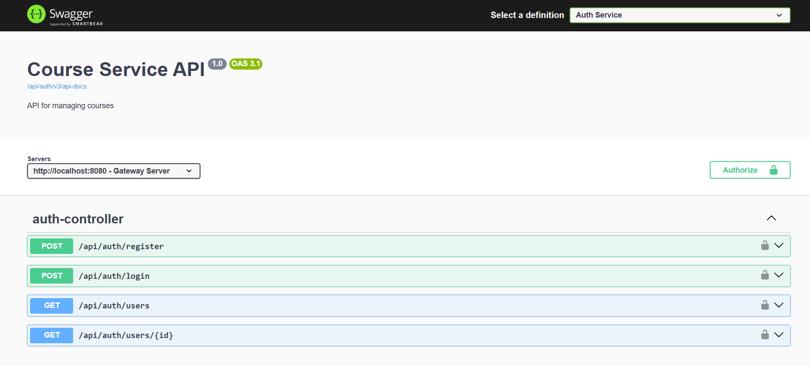
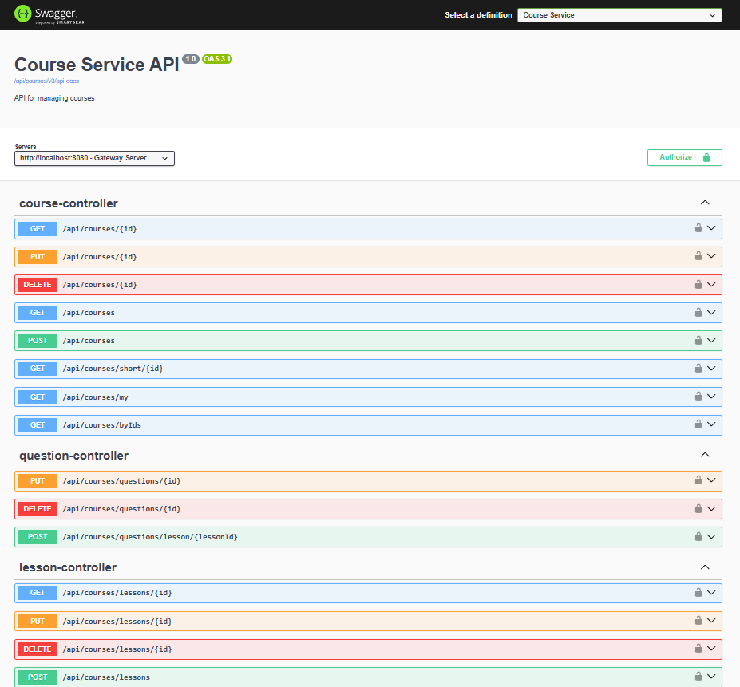
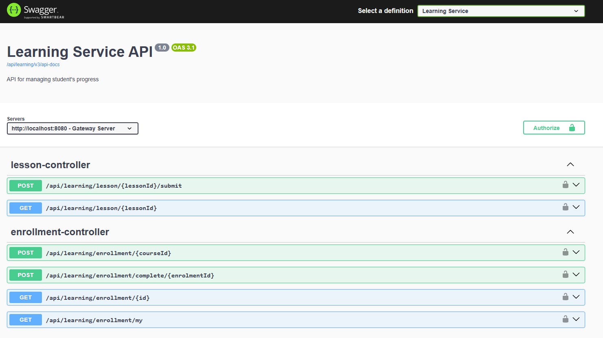

---

## Architecture Overview

```
Client
  │
  ▼
API Gateway (port 8080)          ← JWT pre-validation, routing, aggregated Swagger UI
  │
  ├── Auth Service (8081)         ← Registration, login, JWT issuance
  ├── Course Service (8082)       ← Courses, lessons, quizzes (CRUD)
  └── Learning Service (8083)     ← Enrollments, lesson progress, course completion
        │
        └── RabbitMQ ←────────── Course Service publishes events on course/lesson changes
  │
Eureka Server (8761)             ← Service discovery & load balancing
Redis                            ← Token & query caching across all services
PostgreSQL                       ← Shared DB with isolated schemas per service
```


Each service is independently deployable, uses its own DB schema, and registers itself with Eureka. The API Gateway performs JWT pre-validation before routing — downstream services also independently validate the token using the same shared secret, so every layer enforces security on its own.

---

## Services

### Auth Service
Handles user registration, login, and identity resolution. Issues JWT tokens (24-hour TTL). User lookups are cached in Redis to minimize DB hits for downstream services.

| Method | Path                      | Description                            |
|--------|---------------------------|----------------------------------------|
| `POST` | `/api/auth/register`      | Register a new user                    |
| `POST` | `/api/auth/login`         | Login and receive a JWT token          |
| `GET`  | `/api/auth/users/{id}`    | Fetch a user by ID (internal)          |
| `GET`  | `/api/auth/users?ids=...` | Fetch multiple users by IDs (internal) |

<details>
<summary>Request / Response examples</summary>

**POST** `/api/auth/register`
```json
{
  "username": "john_doe",
  "password": "secret123"
}
```
Response `200 OK`: `"User registered successfully"`

---

**POST** `/api/auth/login`
```json
{
  "username": "john_doe",
  "password": "secret123"
}
```
Response `200 OK`:
```json
{
  "token": "eyJhbGciOiJIUzI1NiJ9..."
}
```
</details>

---

### Course Service
Allows authenticated users to create and manage courses. Each course has lessons, and each lesson can optionally have a quiz with multiple-choice questions. When a lesson or course is modified, a **RabbitMQ fanout event** is published so the Learning Service can react (e.g. reset progress, update enrollment status).

| Method                | Path                                | Description                              |
|-----------------------|-------------------------------------|------------------------------------------|
| `GET`                 | `/api/courses`                      | List all courses                         |
| `POST`                | `/api/courses`                      | Create a course                          |
| `GET`                 | `/api/courses/my`                   | Get courses authored by the current user |
| `GET/PUT/DELETE`      | `/api/courses/{id}`                 | View, update, or delete a course         |
| `POST/GET/PUT/DELETE` | `/api/courses/{courseId}/lessons`   | Manage lessons                           |
| `POST/GET/PUT/DELETE` | `/api/courses/{courseId}/questions` | Manage quiz questions                    |

<details>
<summary>Request / Response examples</summary>

**POST** `/api/courses` *(requires `Authorization: Bearer <token>`)*
```json
{
  "title": "Introduction to Spring Boot",
  "description": "A hands-on course covering REST APIs, security, and testing."
}
```
Response `201 Created`:
```json
{
  "id": 1,
  "title": "Introduction to Spring Boot",
  "description": "A hands-on course covering REST APIs, security, and testing.",
  "author": { "id": 42, "username": "john_doe" },
  "totalLessonsCount": 0
}
```

---

**POST** `/api/courses/{courseId}/lessons`
```json
{
  "title": "Setting Up Your Project",
  "htmlContent": "<h1>Getting Started</h1><p>...</p>",
  "orderIndex": 1,
  "courseId": 1
}
```

---

**POST** `/api/courses/{courseId}/questions` — add a quiz question to a lesson
```json
{
  "text": "Which annotation marks a Spring Boot entry point?",
  "options": [
    { "text": "@SpringBootApplication", "isCorrect": true },
    { "text": "@EnableAutoConfiguration", "isCorrect": false },
    { "text": "@Component", "isCorrect": false }
  ]
}
```
</details>

---

### Learning Service
Manages the student side of the platform — enrollments, lesson completion, quiz submission, and course completion checks. Listens to RabbitMQ events from the Course Service to keep enrollment state consistent when courses change.

| Method | Path                                        | Description                      |
|--------|---------------------------------------------|----------------------------------|
| `POST` | `/api/learning/enrollment/{courseId}`       | Enroll in a course               |
| `GET`  | `/api/learning/enrollment/my`               | Get my enrollments with progress |
| `GET`  | `/api/learning/enrollment/{id}`             | Get a single enrollment          |
| `POST` | `/api/learning/enrollment/complete/{id}`    | Attempt to complete a course     |
| `POST` | `/api/learning/lessons/{lessonId}/progress` | Submit quiz answers              |
| `GET`  | `/api/learning/lessons/{lessonId}/progress` | Get lesson progress              |

<details>
<summary>Request / Response examples</summary>

**POST** `/api/learning/enrollment/{courseId}` — body is not required

Response `201 Created`:
```json
{
  "id": 7,
  "course": { "id": 1, "title": "Introduction to Spring Boot", "author": { "id": 42, "username": "john_doe" } },
  "enrollmentStatus": "IN_PROGRESS",
  "enrolledAt": "2025-05-28T10:00:00",
  "completedAt": null,
  "totalLessons": 3,
  "completedLessons": 0
}
```

---

**POST** `/api/learning/lessons/{lessonId}/progress` — submit quiz answers
```json
{
  "lessonId": 5,
  "answers": {
    "101": "A",
    "102": "C"
  }
}
```
*(keys are question IDs, values are the chosen option labels A/B/C/D)*
</details>

---

### API Gateway
Single entry point for all clients. Pre-validates JWT on every protected route (login and register are public) and rejects unauthorized requests before they reach downstream services. Aggregates Swagger UI from all services at `/swagger-ui.html`.

### Eureka Server
Spring Cloud Netflix Eureka registry. All services register on startup; the Gateway uses it for client-side load balancing.

---

## Tech Stack

| Layer              | Technology                                                                                                                                     |
|--------------------|------------------------------------------------------------------------------------------------------------------------------------------------|
| Language           | Java 21                                                                                                                                        |
| Framework          | Spring Boot 4, Spring Cloud, Resilience4j (Circuit Breaker)                                                                                    |
| API Gateway        | Spring Cloud Gateway MVC                                                                                                                       |
| Security           | Spring Security + JWT (JJWT)                                                                                                                   |
| Service Discovery  | Netflix Eureka                                                                                                                                 |
| Messaging          | RabbitMQ (fanout exchange)                                                                                                                     |
| Caching            | Redis (Spring Cache)                                                                                                                           |
| Database           | PostgreSQL + Flyway migrations                                                                                                                 |
| Inter-service HTTP | OpenFeign                                                                                                                                      |
| API Docs           | SpringDoc OpenAPI 3 (Swagger)                                                                                                                  |
| Containerization   | Docker, Docker Compose, K8S                                                                                                                    |
| CI/CD              | GitHub Actions → GHCR (GitHub Container Registry)                                                                                              |
| Cloud / DevOps     | AWS (EKS, RDS, ElastiCache, Secrets Manager), Helm, Prometheus & Grafana, HPA                                                                  |
| Testing            | JUnit 5, Mockito, Spring Boot Test, MockMvc (`@WebMvcTest`), `@DataJpaTest`, `@SpringBootTest`, Testcontainers (PostgreSQL · Redis · RabbitMQ) |

---

## Key Design Decisions

**Defence in depth for JWT.** The API Gateway is the first line — it rejects requests with missing or malformed tokens before they reach any service. Each downstream service also validates the token independently using the same shared secret. This means a compromised or misconfigured gateway cannot bypass service-level security.

**Event-driven consistency via RabbitMQ.** When a lesson is removed or a quiz is updated in the Course Service, a `CourseUpdatedEvent` is published to a fanout exchange. The Learning Service consumes it and updates enrollment statuses and lesson progress accordingly — keeping services decoupled without synchronous cross-service calls.

**Redis caching reduces latency.** Frequently accessed data (user lookups, course queries, enrollment lists) is cached with a 1-hour TTL and evicted on write operations using `@CacheEvict`.

**Shared DB, isolated schemas — a conscious tradeoff.** All services use the same PostgreSQL instance but different schemas. While preserving logical separation at the data layer, this decision directly maps to optimizing cloud costs on AWS, allowing the entire system to run efficiently on a single managed **AWS RDS (db.t3.micro)** instance within the Free Tier.
**Flyway manages schema migrations.** The Course and Learning services use versioned SQL migrations instead of Hibernate `ddl-auto`, making schema changes trackable and reversible.

**Fault Tolerance via Resilience4j Circuit Breaker.** To prevent cascading failures across the system, OpenFeign clients (e.g., inter-service communication between `Learning Service`, `Course Service`, and `Auth Service`) and `API Gateway` are protected by Resilience4j Circuit Breakers. If a downstream service fails or times out, the circuit opens, preventing network congestion and immediately falling back to a degraded state (or cached data) instead of hanging user requests.

**Cloud-native production configuration.** The application profiles are separated between local development (`docker-compose`) and cloud deployment. In production (**AWS EKS**), all sensitive credentials (DB passwords, JWT secrets, RabbitMQ credentials) are decoupled from the code entirely and injected dynamically into Spring Boot pods via the **External Secrets Operator (ESO)** from **AWS Secrets Manager**.

---

## What I learned
**Designing for failure, not just for the happy path.**
Building event-driven consistency between Course and Learning services forced me to think beyond the normal request-response cycle. When a lesson is deleted, the Learning Service needs to react — but it can't rely on a synchronous call that might fail or time out. Implementing a RabbitMQ fanout exchange taught me that decoupling isn't just an architectural pattern; it's a decision about where you put your failure handling.

**Defence in depth is not paranoia.**
I initially validated JWT only at the Gateway level — it seemed enough. Then I realised: if the Gateway misconfigures a route, or a service gets called directly in a staging environment, there's nothing stopping an unauthenticated request from going through. Adding independent token validation in each downstream service felt redundant at first, but it's the difference between trusting your perimeter and actually being secure.

**Shared database, isolated schemas — a conscious tradeoff.**
I chose one PostgreSQL instance with separate schemas instead of fully isolated databases per service. It simplified local setup and made Flyway migrations easier to reason about. But it also means services share infrastructure — a lesson in understanding that "microservices best practices" always come with context. This setup makes sense for a solo project; a production system with team ownership per service would need stricter isolation.

**Testing at multiple levels changes how you write code.**
Writing `@DataJpaTest`, `@WebMvcTest`, and full `@SpringBootTest` integration tests with Testcontainers made me structure code differently from the start — because code that's hard to test is usually code with too many responsibilities. The 57 test files weren't a goal; they were a side effect of building things in a way that could actually be verified.

**Redis caching is easy to add and easy to get wrong.**
Adding `@Cacheable` takes five minutes. Figuring out when to evict — and making sure `@CacheEvict` fires on every write path, including edge cases — takes much longer. I learned that caching is a consistency problem first and a performance optimization second.

**Cascading failures are real, and boundaries must be guarded.**
Adding Resilience4j taught me that a distributed system is only as strong as its weakest link. Initially, an outage or lag in the `Course Service` could freeze threads in the `Learning Service` due to synchronous OpenFeign calls. Implementing Circuit Breakers made me shift from a "hope for the best" mindset to designing for graceful degradation. I learned how to configure threshold metrics (failure rates, slow call rates) and write meaningful fallback methods that keep the user experience intact even when a partial outage occurs.

**Moving from Local Containers to Cloud Production.**
Deploying the platform to **AWS EKS** changed my perspective on backend development. I learned that writing efficient Java code is only half the battle; the other half is understanding how your services behave in a live cloud environment. Configuring **Horizontal Pod Autoscaling (HPA)** to handle load, isolating sensitive credentials using **AWS Secrets Manager**, and setting up production-grade monitoring via **Prometheus & Grafana** to track cluster health taught me how to bridge the gap between a local Spring Boot application and a secure, observable cloud deployment.

**The Power of Declarative Deployments with Helm.**
Deploying microservices manually using raw Kubernetes manifests quickly becomes unmanageable. By adopting **Helm**, I learned how to package, version, and manage the entire application lifecycle declaratively. Templateizing configurations for different environments, managing complex dependency graphs (like deploying our services alongside the External Secrets Operator), and executing clean rollbacks taught me how to manage cloud-native applications at scale, steering away from manual `kubectl` operations toward production-ready deployment workflows.

---

## Running Locally

**Prerequisites:** Docker and Docker Compose

```bash
docker compose up -d
```

| Interface               | URL                                    |
|-------------------------|----------------------------------------|
| API Gateway             | http://localhost:8080                  |
| Swagger UI (aggregated) | http://localhost:8080/swagger-ui.html  |
| Eureka Dashboard        | http://localhost:8761                  |
| RabbitMQ Management     | http://localhost:15672 (guest / guest) |

---

## Testing

The project has **57 test files** across all services, covering unit, slice (MockMvc), and full integration tests.

```bash
mvn test -pl common-dto,auth-service,course-service,learning-service,api-gateway -am
```

Integration tests use **Testcontainers** to spin up real PostgreSQL, Redis, and RabbitMQ instances. OpenFeign clients to external services are mocked with `@MockBean` to keep tests isolated and fast.

| Service          | Test files |
|------------------|------------|
| Course Service   | 24         |
| Learning Service | 16         |
| Auth Service     | 10         |
| API Gateway      | 7          |
| Common DTO       | 1          |

---

## CI/CD

A GitHub Actions pipeline runs on every push to `master`:

1. **Test** — runs the full test suite with JDK 21
2. **Build & Push** — builds Docker images and pushes them to GitHub Container Registry (GHCR)

Images are tagged `latest` and referenced in `docker-compose.yml`, so `docker compose up` always pulls the most recent build.

---

## Project Structure

```
lcm-microservices/
├── common-dto/          # Shared DTOs, request/response models, base JWT service
├── auth-service/        # Authentication & user management
├── course-service/      # Course, lesson & quiz management
├── learning-service/    # Enrollments & progress tracking
├── api-gateway/         # Routing, JWT pre-validation, Swagger aggregation
├── eureka-server/       # Service registry
└── docker-compose.yml   # Full local setup
```

---

# AWS Deployment

## Architecture

```
                         ┌─────────────────────────────────────────┐
                         │           AWS eu-central-1              │
                         │                                         │
Internet ──────────────► │  ALB (Application Load Balancer)        │
                         │         │                               │
                         │  ┌──────▼──────────────────────────┐   │
                         │  │        EKS Cluster               │   │
                         │  │                                  │   │
                         │  │  api-gateway (LoadBalancer/ALB)  │   │
                         │  │         │                        │   │
                         │  │  ┌──────┼──────┐                │   │
                         │  │  │      │      │                │   │
                         │  │ auth course learning            │   │
                         │  │                                  │   │
                         │  │  eureka-server                   │   │
                         │  │  rabbitmq (self-managed)         │   │
                         │  │  Prometheus + Grafana + Loki     │   │
                         │  │                                  │   │
                         │  └──────────────────────────────────┘   │
                         │         │              │                 │
                         │  ┌──────▼──────┐  ┌───▼────────────┐   │
                         │  │     RDS     │  │  ElastiCache   │   │
                         │  │ PostgreSQL  │  │    Redis       │   │
                         │  │ db.t3.micro │  │ cache.t3.micro │   │
                         │  │ (Free Tier) │  │  (Free Tier)   │   │
                         │  └─────────────┘  └────────────────┘   │
                         └─────────────────────────────────────────┘
```

## Infrastructure

| Component | AWS Service | Type | Cost |
|---|---|---|---|
| K8s cluster | EKS | Control plane | ~$72/mo |
| Worker nodes | EC2 t3.medium Spot | 3 nodes | ~$12-18/mo |
| Load Balancer | ALB | Ingress | ~$16/mo |
| Database | RDS PostgreSQL db.t3.micro | Managed | Free Tier |
| Cache | ElastiCache Redis cache.t3.micro | Managed | Free Tier |
| Container Registry | GHCR (GitHub) | - | Free |
| **Total (active)** | | | **~$100-106/mo** |
| **Total (nodes scaled to 0)** | | | **~$15-20/mo** |

## Secrets Management

All sensitive credentials (DB password, JWT secret, RabbitMQ credentials) are stored in **AWS Secrets Manager** and injected into pods at runtime via **External Secrets Operator (ESO)**.

```
AWS Secrets Manager (/lms/prod-secrets)
        │
        ▼
External Secrets Operator
        │
        ▼
K8s Secret (lms-secrets)
        │
        ▼
  Spring Boot pods (via envFrom)
```

No secrets are stored in Git or Helm values files.

## Screenshots

### EKS Cluster
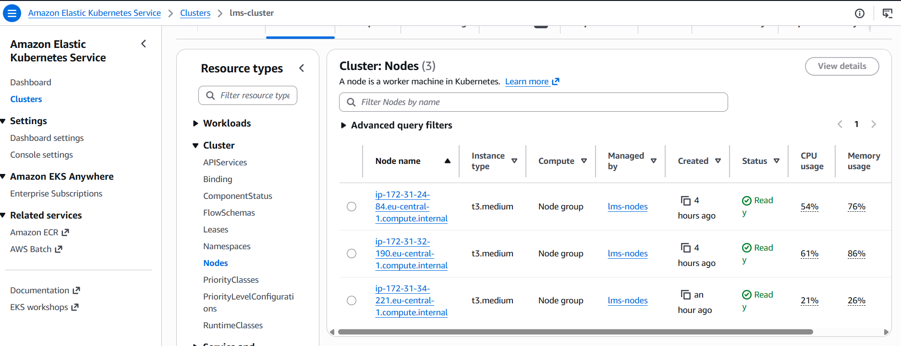
> AWS Console → EKS → lms-cluster. Shows 3 managed Spot nodes, K8s version 1.34.

### EKS Nodes
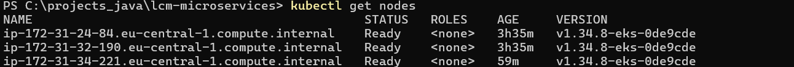
> kubectl get nodes — all nodes in Ready state.

### Running Pods
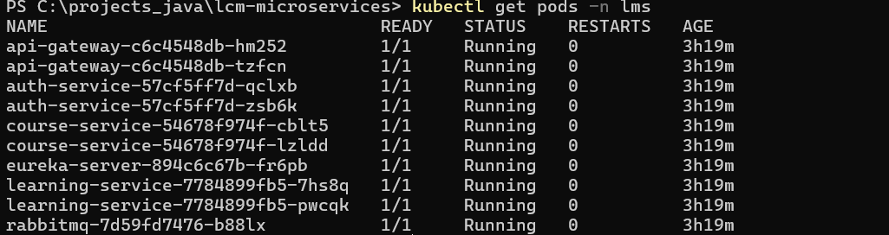
> kubectl get pods -n lms — all microservices running with HPA active.

### RDS PostgreSQL
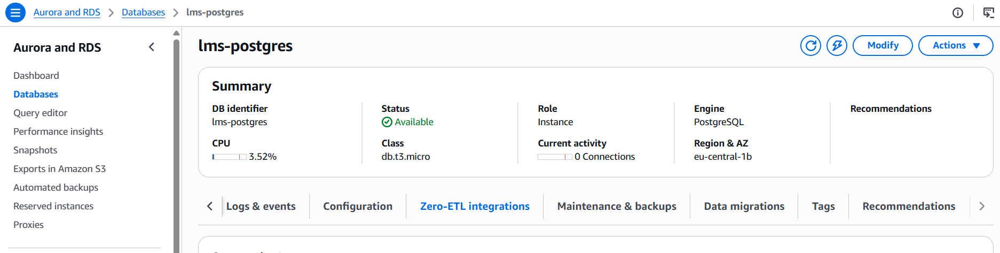
> AWS Console → RDS → lms-postgres. Status: Available, db.t3.micro, Free Tier.

### ElastiCache Redis
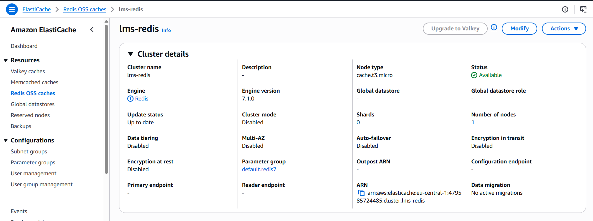
> AWS Console → ElastiCache → lms-redis. Status: Available, cache.t3.micro, Free Tier.

### AWS Secrets Manager
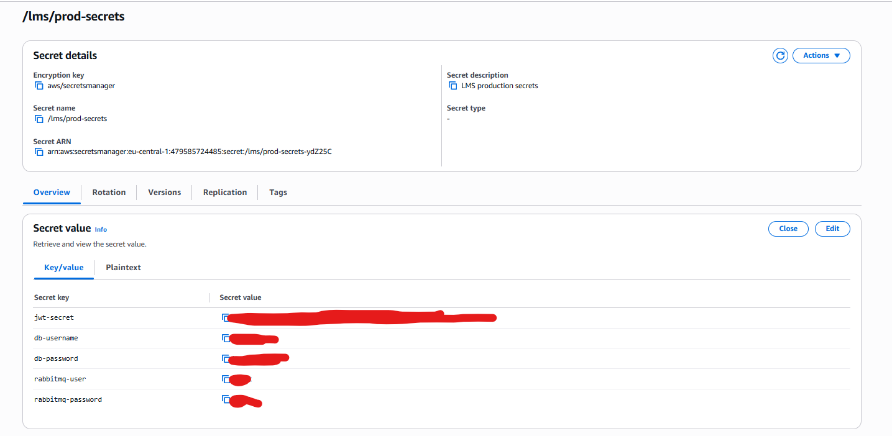
> AWS Console → Secrets Manager → /lms/prod-secrets. All credentials stored securely.

### External Secrets Operator
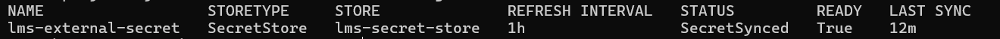
> kubectl get externalsecret -n lms — SecretSynced: True.

### ALB Endpoint — API Health Check
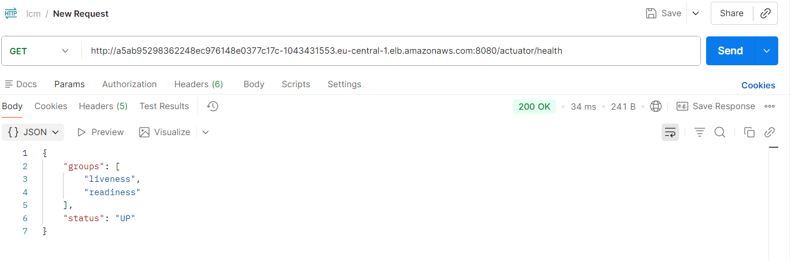
> GET /actuator/health → 200 OK, status: UP. Public ALB endpoint.

### API — Postman
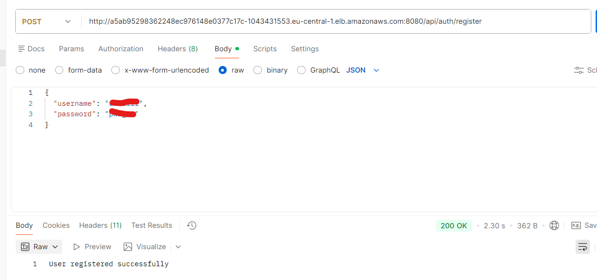
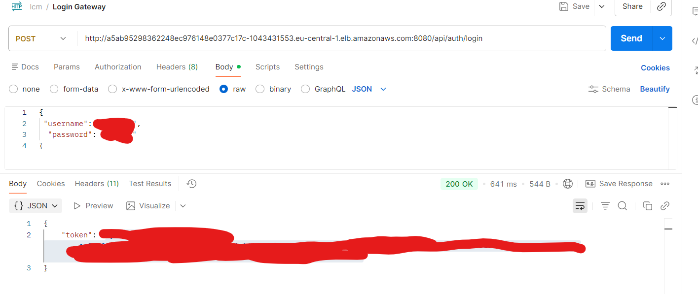
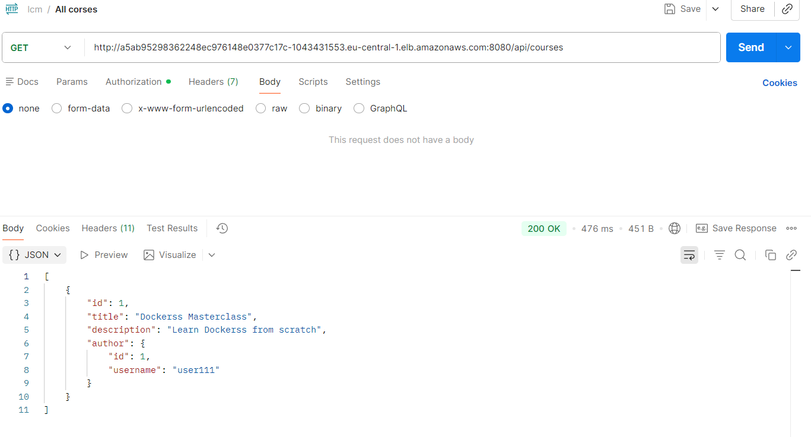
> Successful API call through ALB endpoint (register/login/courses).

### Grafana Dashboard
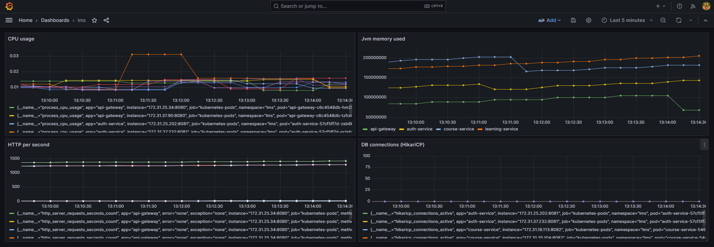
> Grafana accessible via ALB. JVM memory, HTTP requests, HikariCP metrics visible.

### Prometheus Targets
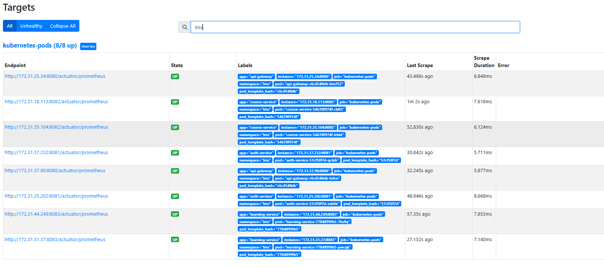
> All LMS microservices scraped by Prometheus via pod annotations.

### HPA
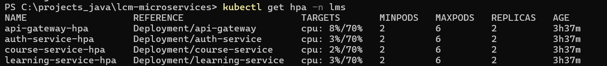
> kubectl get hpa -n lms — HPA active for all services.

## Cluster Management
```bash
# Scale down nodes when not in use (save ~$30/mo, pay only $72 for control plane)
eksctl scale nodegroup --cluster=lms-cluster --name=lms-nodes --nodes=0 --region eu-central-1
 
# Scale up
eksctl scale nodegroup --cluster=lms-cluster --name=lms-nodes --nodes=3 --region eu-central-1
 
# Delete cluster completely (pay $0)
eksctl delete cluster --name=lms-cluster --region eu-central-1
```